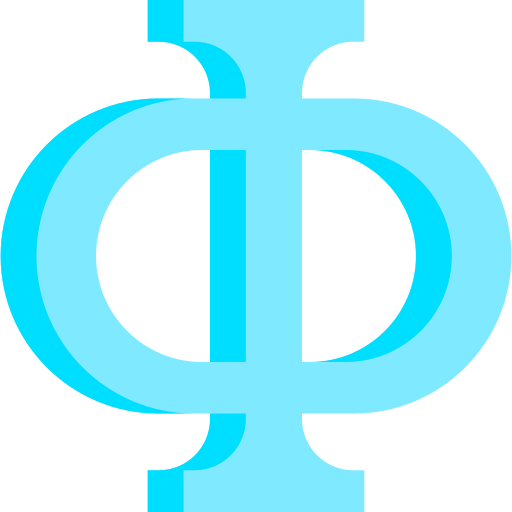

# LightPHE

<div align="center">

[](https://pepy.tech/project/lightphe)
[](https://github.com/serengil/LightPHE/stargazers)
[](https://github.com/serengil/LightPHE/actions/workflows/tests.yml)
[](https://github.com/serengil/LightPHE/blob/master/LICENSE)
[](https://www.patreon.com/serengil?repo=lightphe)
[](https://github.com/sponsors/serengil)

[](https://sefiks.com)
[](https://www.youtube.com/@sefiks?sub_confirmation=1)
[](https://twitter.com/intent/user?screen_name=serengil)

</div>

<p align="center"></p>

LightPHE is a lightweight partially homomorphic encryption library for python. It is a hybrid homomoprhic encryption library wrapping many schemes such as [`RSA`](https://sefiks.com/2023/03/06/a-step-by-step-partially-homomorphic-encryption-example-with-rsa-in-python/), [`ElGamal`](https://sefiks.com/2023/03/27/a-step-by-step-partially-homomorphic-encryption-example-with-elgamal-in-python/), [`Exponential ElGamal`](https://sefiks.com/2023/03/27/a-step-by-step-partially-homomorphic-encryption-example-with-elgamal-in-python/), [`Elliptic Curve ElGamal`](https://sefiks.com/2018/08/21/elliptic-curve-elgamal-encryption/), [`Paillier`](https://sefiks.com/2023/04/03/a-step-by-step-partially-homomorphic-encryption-example-with-paillier-in-python/), [`Damgard-Jurik`](https://sefiks.com/2023/10/20/a-step-by-step-partially-homomorphic-encryption-example-with-damgard-jurik-in-python/), [`Okamoto–Uchiyama`](https://sefiks.com/2023/10/20/a-step-by-step-partially-homomorphic-encryption-example-with-okamoto-uchiyama-in-python/), [`Benaloh`](https://sefiks.com/2023/10/06/a-step-by-step-partially-homomorphic-encryption-example-with-benaloh-in-python-from-scratch/), [`Naccache–Stern`](https://sefiks.com/2023/10/26/a-step-by-step-partially-homomorphic-encryption-example-with-naccache-stern-in-python/), [`Goldwasser–Micali`](https://sefiks.com/2023/10/27/a-step-by-step-partially-homomorphic-encryption-example-with-goldwasser-micali-in-python/).

Even though fully homomorphic encryption (FHE) has become available in recent times, but when considering the trade-offs, LightPHE emerges as a more efficient and practical choice. If your specific task doesn't demand the full homomorphic capabilities, opting for partial homomorphism with LightPHE is the logical decision. LightPHE is notably faster and demands fewer computational resources compared to FHE. Besides, it generates smaller ciphertexts, making it well-suited for memory-constrained environments. Finally, LightPHE strikes a favorable balance between security and efficiency for practical use cases.

# Installation

The easiest way to install the LightPHE package is to install it from python package index (PyPI).

```shell
pip install lightphe
```

Then you will be able to import the library and use its functionalities.

```python
from lightphe import LightPHE
```

# Summary of Homomorphic Features of Different Cryptosystems in LightPHE

In summary, LightPHE is covering following algorithms and these are partially homomorphic with respect to the operations mentioned in the following table.

| Algorithm | Multiplicatively<br>Homomorphic | Additively<br>Homomorphic | Multiplication with a Plain Constant | Exclusively<br>Homomorphic | Regeneration<br>of Ciphertext |
| --- | --- | --- | --- | --- | --- |
| RSA | ✅ | ❌ | ❌ | ❌ | ❌ |
| ElGamal | ✅ | ❌ | ❌ | ❌ | ✅ |
| Exponential ElGamal | ❌ | ✅ | ✅ | ❌ | ✅ |
| Elliptic Curve ElGamal | ❌ | ✅ | ✅ | ❌ | ❌ |
| Paillier | ❌ | ✅ | ✅ | ❌ | ✅ |
| Damgard-Jurik | ❌ | ✅ | ✅ | ❌ | ✅ |
| Benaloh | ❌ | ✅ | ✅ | ❌ | ✅ |
| Naccache-Stern | ❌ | ✅ | ✅ | ❌ | ✅ |
| Okamoto-Uchiyama | ❌ | ✅ | ✅ | ❌ | ✅ |
| Goldwasser-Micali | ❌ | ❌ | ❌ | ✅ | ❌ |

# Building cryptosystem

Once you imported the library, then you can build a cryptosystem for several algorithms. This basically generates private and public key pair.

```python
algorithms = [
  "RSA",
  "ElGamal",
  "Exponential-ElGamal",
  "Paillier",
  "Damgard-Jurik",
  "Okamoto-Uchiyama",
  "Benaloh",
  "Naccache-Stern",
  "Goldwasser-Micali",
  "EllipticCurve-ElGamal"
]

cs = LightPHE(algorithm_name = algorithms[0])
```

# Encryption & Decryption

Once you built your cryptosystem, you will be able to encrypt and decrypt messages with the built cryptosystem.

```python
# define plaintext
m = 17

# calculate ciphertext
c = cs.encrypt(m)

assert cs.decrypt(c) == m
```

# Homomorphic Operations

Once you have the ciphertext, you will be able to perform homomorphic operations on encrypted data. For instance, Paillier is homomorphic with respect to the addition. In other words, decryption of the addition of two ciphertexts is equivalent to addition of plaintexts. 

```python
cs = LightPHE(algorithm_name = "Paillier")

# define plaintexts
m1 = 17
m2 = 23

# calculate ciphertexts
c1 = cs.encrypt(m1)
c2 = cs.encrypt(m2)

# performing homomorphic addition on ciphertexts
assert cs.decrypt(c1 + c2) == m1 + m2
```

Besides, Paillier is supporting multiplying ciphertexts by a known plain constant. Simply put, decryption of scalar multiplication of ciphertext is equivalent to that constant times plaintext as well.

```python
# scalar multiplication
k = 5
assert cs.decrypt(k * c1) == k * m1
```

Similar to the most of additively homomorphic algorithms, Paillier lets you to regenerate ciphertext while you are not breaking its plaintext restoration. You may consider to do this re-generation many times to have stronger ciphertexts.

```python
c1_prime = cs.regenerate_ciphertext(c1)
assert c1_prime.value != c1.value
assert cs.decrypt(c1_prime) == m1
assert cs.decrypt(c1) == m1
```

Finally, if you try to perform an operation that algorithm does not support, then an exception will be thrown. For instance, Paillier is not homomorphic with respect to the multiplication or xor. To put it simply, you cannot multiply two ciphertexts. If you enforce this calculation, you will have an exception.

```python
# pailier is not homomorphic with respect to the multiplication
with pytest.raises(ValueError, match="Paillier is not homomorphic with respect to the multiplication"):
  c1 * c2

# pailier is not homomorphic with respect to the xor
with pytest.raises(ValueError, match="Paillier is not homomorphic with respect to the exclusive or"):
  c1 ^ c2
```

However, if you tried to multiply ciphertexts with RSA, or xor ciphertexts with Goldwasser-Micali, these will be succeeded because those cryptosystems support those homomorphic operations.

# Contributing

All PRs are more than welcome! If you are planning to contribute a large patch, please create an issue first to get any upfront questions or design decisions out of the way first.

You should be able run `make test` and `make lint` commands successfully before committing. Once a PR is created, GitHub test workflow will be run automatically and unit test results will be available in [GitHub actions](https://github.com/serengil/LightPHE/actions/workflows/tests.yml) before approval. Besides, workflow will evaluate the code with pylint as well.

# Citation

Please cite LightPHE in your publications if it helps your research. Here is its BibTex entry:

```BibTeX
@misc{serengil2023lightphe,
  abstract     = {A Lightweight Partially Homomorphic Encryption Library for Python},
  author       = {Serengil, Sefik Ilkin},
  title        = {LightPHE},
  howpublished = {https://github.com/serengil/LightPHE},
  year         = {2023}
}
```

Also, if you use LightPHE in your projects, please add `LightPHE` in the `requirements.txt`.

# License

LightPHE is licensed under the MIT License - see [`LICENSE`](LICENSE) for more details.
